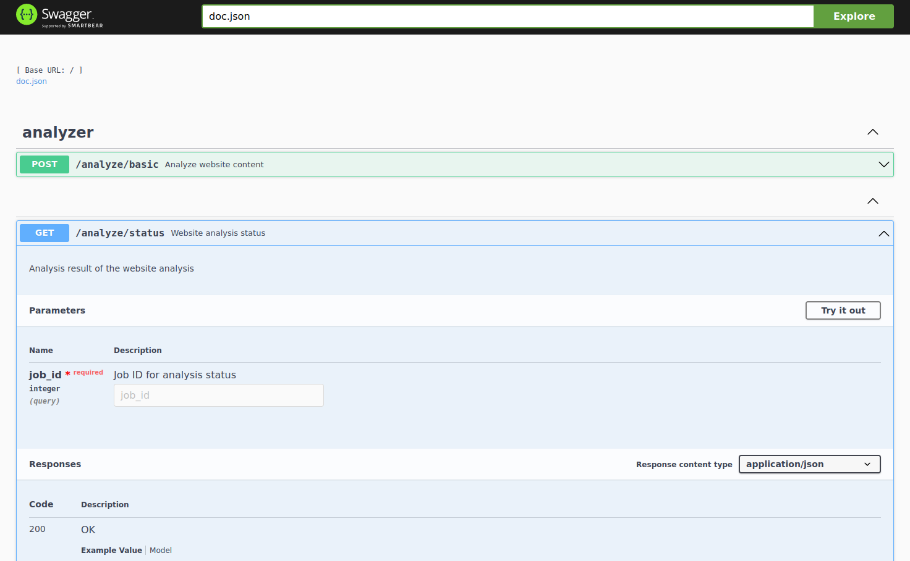
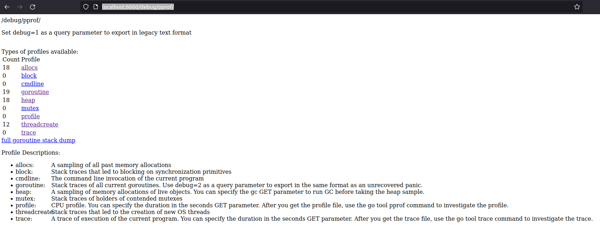
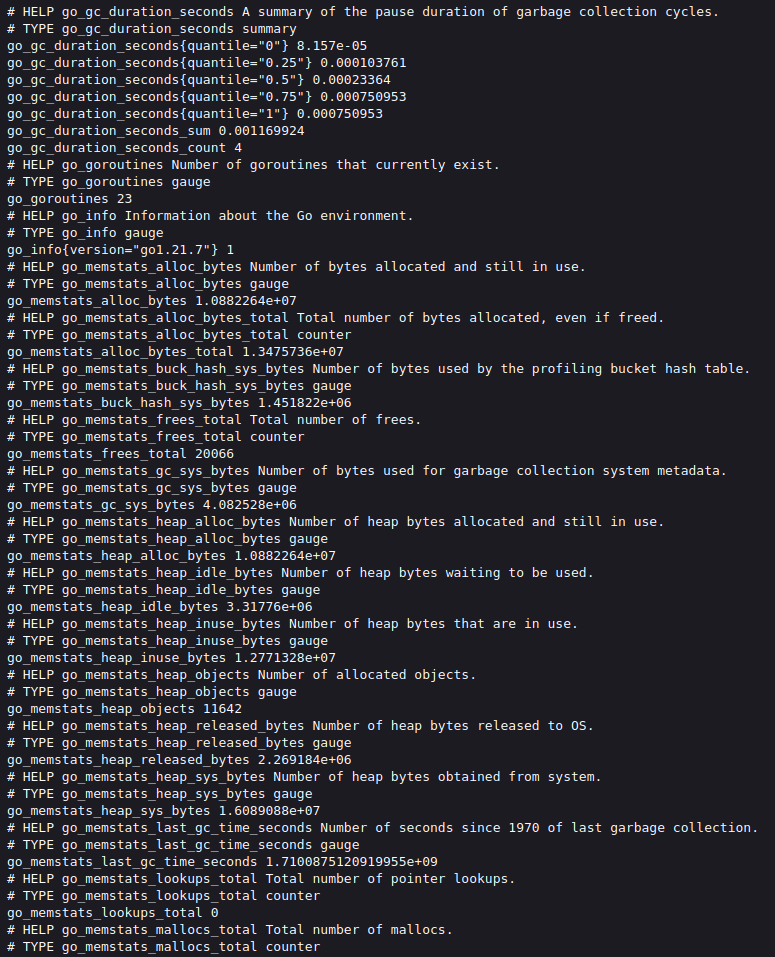

# Website-Analyzer

Website analyzer using Go 1.21 

## Description

Website analyzer using Go 1.21 and colly library (`github.com/gocolly/colly`) to analyze few basic information of a given site lite the HTML version,Title,
Is the web page given by the target URL a login page, how many internal and external links does it have etc.
However this Project currently support only for parsing and analyzing HTML only. Links calling through javascript onclick event etc are not yet supported by this project.
This project can be used as a base project to implement extensive functionality.
Prometheus Metrics, Swagger API docs and pprof are implemented in this project. 
Most parts of the business layer, gateways, utils and helpers are covered with unit tests.

A frontend client supporting the APIs of this service can be found in the  https://github.com/Jagath01234/website-analyzer-react-client repository.
## Table of Contents

- [Requirements](#requirements)
- [Configuration](#configuration)
- [Installation](#installation)
- [Usage](#usage)
- [Limitations & Possible improvements](#Limitations_&_Possible_improvements)
- [License](#license)


## Requirements
- Go 1.21
- Configured GOROOT and GOPATH.
- Configured github token or made the GOPROXY to `https://proxy.golang.org,direct` to pull the dependencies from github. (This is required since there are go dependencies which has version higher than `v1`.)

## Configuration
- Edit the `config.json` file in the project root to change the configurations as required. 
Configurations are self-exnoplanatory.
```json
{
  "app": {
    "port": 8080
  },
  "cache": {
    "max_size": 1000,
    "prune_size": 50,
    "expiry_time_secs": 600
  },
  "api_docs": {
    "is_enabled": true
  },
  "pprof": {
    "is_enabled": true,
    "port": 6060
  },
  "metrics": {
    "port": 7070
  },
  "worker": {
    "buffer_size": 50,
    "pool_size": 10
  }
}

```

## Installation
- Navigate to project root directory using terminal.
- Download the dependencies with `go mod tidy`.
- Run with `go run main go`.

## Usage
- There are two endpoints in this service `/analyze/basic` and `/analyze/status`.
- Can See the complete documentation for the endpoints using the PAI documentation once the project is up and 
 running with the ` "api_docs": {  "is_enabled": true  },` configuration using the `<host>:<port>/doc/ui/index.html#/`
  
- pprof is added to this project for the profiling and it also can be enabled using the configs. However it's exposed only for the `localhost` due to security reasons.Can be accessed using `http://localhost:6060/debug/pprof/`

- Prometheus metrics has also been added and can be accessed using `http://<host>:<metrics_port>/metrics`

- Summary metrics has added to the service as a middleware.

## Limitations & Possible improvements
- User validation has not been implemented and need to implement using an auth service and a auth validation middleware.
- Only the compile time configuration is implemented for the project as of today. Better to implement some external configurations using config services like ETCD.
- Does not support extended analysis for the javascript functionalities. 

## License
- This project is licensed under the GNU Lesser General Public License v3.0 (LGPL-3.0).
